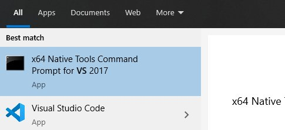

# CLFFT ImageJ Build

[ops-experiments-opencl](https://github.com/imagej/ops-experiments/tree/master/ops-experiments-opencl) integrates [CLFFT](https://github.com/arrayfire/clFFT) with ImageJ2 so we can write fast FFT based algorithms (like deconvolution).  The project uses [JavaCPP](https://github.com/bytedeco/javacpp).

The insturctions are specific to integrating CLFFT, however a similar approach can be used to integrate other native libraries with ImageJ.  In fact the [ops-experiments](https://github.com/imagej/ops-experiments) project has used the same technique to (experimentally) integrate cuda, mkl and arrayfire with ImageJ. 

## pre-requisites

1. c++ compiler (g++ linux, [Microsoft Visual Studio Community](https://visualstudio.microsoft.com/downloads/) on Windows)
2. OpenCL
3.  [CMake](https://cmake.org/)
4. Eclipse, Maven, the ussual java stuff.  

## native build 

The native build is invoked automatically as part of the maven build process.  However it is still sometimes useful to build the native part separately. 

This [CMake file](https://github.com/imagej/ops-experiments/blob/master/ops-experiments-opencl/native/opencldeconv/CMakeLists.txt) finds OpenCL and defines variables for the OpenCL include directory, and the CLFFT library location. 

This [script](https://github.com/imagej/ops-experiments/blob/master/ops-experiments-opencl/native/cppbuild.sh) adapted [from](https://github.com/imagej/ops-experiments/blob/master/ops-experiments-opencl/native/cppbuild.sh) sets up build variables and calls the project specific build script.  Call this script to start the native build (maven calls it too as part of the java build).

The project specific build script is [here](https://github.com/imagej/ops-experiments/blob/master/ops-experiments-opencl/native/opencldeconv/cppbuild.sh).  This calls CMake with OS specific variable.  The variables may have to be tweaked for specific OS and System.  

### Linux

Run the top level [cppbuild.sh](https://github.com/imagej/ops-experiments/blob/master/ops-experiments-opencl/native/opencldeconv/cppbuild.sh) from a bash terminal. 

### Windows

To run the build script you need a bash terminal that is also set up with a windows c++ compiler.  The process I use is

1.  Start a Visual Studio x64 prompt.  
  
2.  Start a git bash prompt from the Visual Studio prompt  
```C:\Program Files\Git\bin\sh.exe```
3. Run the top level [cppbuild.sh](https://github.com/imagej/ops-experiments/blob/master/ops-experiments-opencl/native/opencldeconv/cppbuild.sh) from a bash terminal.  

## Maven build  

Simply call ```mvn``` from the ```ops-experiments-opencl``` directory.  

The important pieces of configuration are  

1.  [exec-maven-plugin](https://github.com/imagej/ops-experiments/blob/master/ops-experiments-opencl/pom.xml#L95) calls ```cppbuild.sh```.  Thus there is no need to run the native build separately, except when trouble shooting. 
2.  [java-cpp-plugin](https://github.com/imagej/ops-experiments/blob/master/ops-experiments-opencl/pom.xml#L140) defines location of include files and native library built above.  
3.  [java-cpp-plugin](https://github.com/imagej/ops-experiments/blob/master/ops-experiments-opencl/pom.xml#L153) defines wrapper class.  
4.  The [wrapper class](https://github.com/imagej/ops-experiments/blob/master/ops-experiments-opencl/src/main/java/net/imagej/ops/experiments/filter/deconvolve/OpenCLWrapper.java#L8) specifies platform specific include and linkpaths, and maps the native [functions](https://github.com/imagej/ops-experiments/blob/master/ops-experiments-opencl/src/main/java/net/imagej/ops/experiments/filter/deconvolve/OpenCLWrapper.java#L25)  


