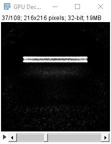

# Ops Experiments Deconvolution

## Get the files

[windows files can be found here](https://www.dropbox.com/sh/gwodw2y75m2ivsb/AACWzMIOS6YSdfIj7KJaHuuza?dl=0)

Linux files available on request.  Ask on [Image Message Board](https://forum.image.sc/)

Mac version is perhaps possible if you are willing to have a long involved discussion on [ImageSC](https://forum.image.sc/)

## Test Images

Test images are [here](https://www.dropbox.com/sh/owh83l3isipv3xy/AABx_qZ69uLU5jnbNw1gVkx-a?dl=0)

## Update site

An official update site is quite possible soon.  It's not here yet because a couple the dependencies (javacpp specifically) need to be updated in Fiji.  It's also unclear to me how to handle Windows vs Linux distribution as different native libs need to be distributed in each case. 

## Installation

Copy all jar files into the 'Fiji.app/jars' directory.  You may want to install a fresh 'experimental' version of Fiji, because you need to overwrite ```javacpp.jar``` and ```imglib2.jar``` with newer versions. 

## OpenCL CLIJ friendly version 

Add the CLIJ update site.  

In the dropbox directory there is a script called 'CLIJDecon.py'.  The script is also [here](https://github.com/imagej/ops-experiments/blob/master/ops-experiments-opencl/ijscripts/CLIJDecon.py)  Load and run this script in the Fiji script editor.  A dialog will appear and you choose an image and PSF.  

  

After running the script a message should appear indicating which GPU device is used.  Verify it is using the GPU (CLIJ sometimes defaults to the CPU)  

  

And a deconvolved image should appear too... something like this...  

  

## CUDA (YacuDecu) plugins

There are also some plugins available that derive from Bob Pepin's [YacuDecu](https://github.com/bobpepin/YacuDecu).  Some changes have made for ImageJ integration, non-circulant deconvolution, and assymetrical PSFs.  The updated code base is [here](https://github.com/imagej/ops-experiments/tree/master/ops-experiments-cuda).  

After adding the jars from the dropbox folder the following menu should appear 

  

These plugins require updated NVIDIA drivers and [Cuda 10+](https://developer.nvidia.com/cuda-downloads)

1.  YacuDecu Deconvolution - choose an image and PSF and deconvolve.
4.  YacuDecu Theoretical PSF - Deconvolve an image with a theoretical PSF.   
2.  YacuDecu Deconvolution Batch - experimental interface for batch processing several files.  
3.  YacuDecu Refractive Index Tester - Deconvolved an image several times over, using a range of sample refractice indexes.  Useful for evaluating the true RI of a sample.  

Any questions about these plugins?? Or problems running these plugins ??  Ask on [ImageSC Message Board](https://forum.image.sc/)